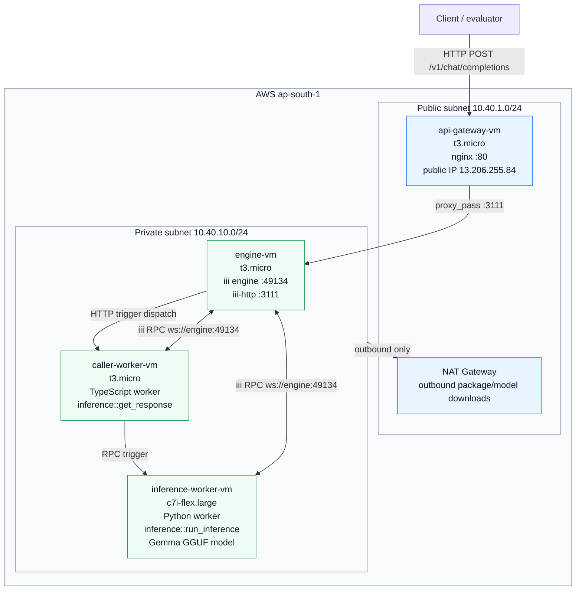

# Architecture



## Request Flow

```text
Client
  -> api-gateway-vm nginx :80
  -> engine-vm iii-http :3111
  -> caller-worker-vm inference::get_response
  -> inference-worker-vm inference::run_inference
  -> caller-worker-vm formats JSON
  -> api-gateway-vm returns HTTP response
```

## Network Boundaries

```text
Public internet can reach only:
- api-gateway-vm:80
- api-gateway-vm:22 from operator CIDR

Private subnet contains:
- engine-vm, no public IP
- caller-worker-vm, no public IP
- inference-worker-vm, no public IP

Private VMs use NAT gateway only for outbound package/model downloads.
```
